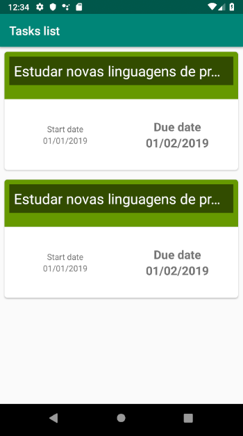
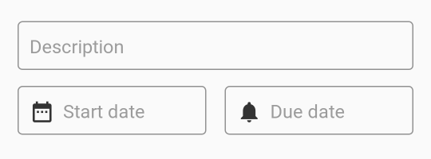
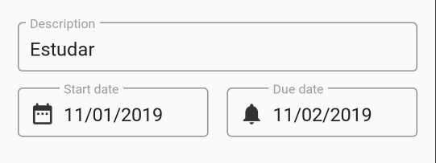

Projeto para registrar tarefas com data de inicío e fim. O App deve conter as seguintes features:

- Lista de tarefas;
- Cadastro, edição e remoção;
- Persistência interna das mudanças;

O projeto base, com arquivos e orientações iniciais, é fornecido a partir do diretório **Todo**. Realize o import do mesmo e implemente as features solicitadas.

Escolha os componentes, técnicas e abordagens de sua preferência para a implementação do fluxo esperado.

## Implementação das telas

Implemente a tela para a lista de tarefas conforme amostra:

Crie o seguinte formulário para as operações de inserção e remoção:

Ao ser preenchido, apresentar o seguinte aspecto visual:

